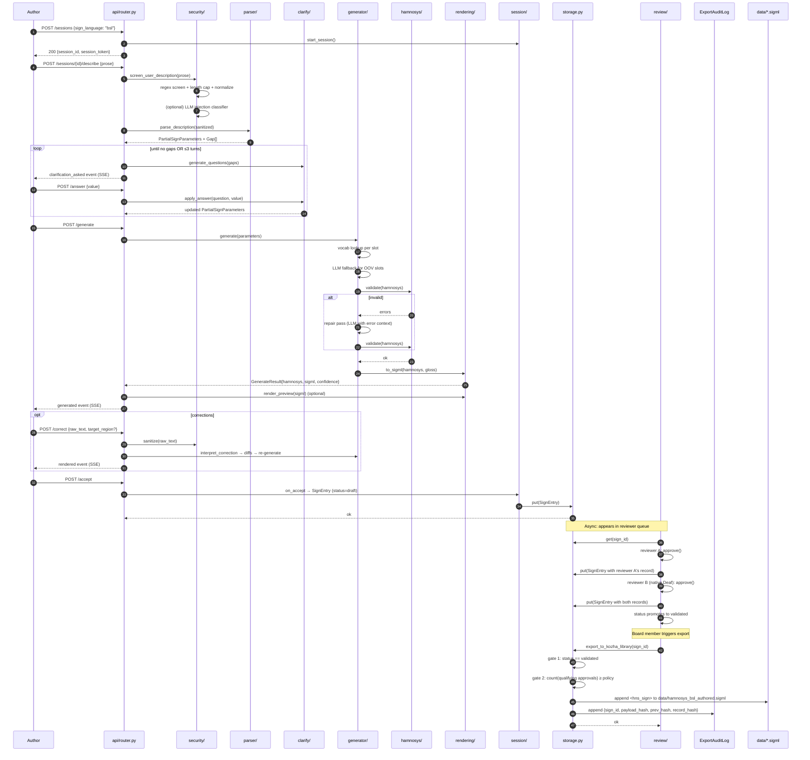

# Architecture

This document describes the chat2hamnosys subsystem at three levels:

1. **Component diagram** — every module from Prompts 2–15, how they connect, and what each one
   explicitly does *not* do.
2. **Data-flow diagram** — the lifecycle of a single sign entry from draft through validated and
   exported.
3. **Threat model** — trust boundaries and where each defense from Prompt 17 sits.

All diagrams are Mermaid so they render natively on GitHub.

---

## 1. Component diagram

```mermaid
flowchart TB
    subgraph Client["Browser (public/chat2hamnosys/)"]
        UI[Authoring UI<br/>app.js / index.html]
        REVIEW[Reviewer console<br/>review/]
        AVATAR[CWASA avatar<br/>SiGML player]
    end

    subgraph API["api/ — HTTP surface"]
        ROUTER[router.py<br/>session endpoints]
        ADMIN[admin.py<br/>/dashboard /metrics /cost]
        SECURITY[security.py<br/>screen + sanitize]
        ERRORS[errors.py<br/>typed ApiError tree]
        TOKENS[token_store.py<br/>X-Session-Token auth]
    end

    subgraph Pipeline["Authoring pipeline"]
        PARSER[parser/<br/>prose → PartialParameters + Gap[]]
        CLARIFY[clarify/<br/>Gap → Question → resolved value]
        GEN[generator/<br/>Parameters → HamNoSys<br/>vocab + LLM fallback + repair]
        HAMNOSYS[hamnosys/<br/>Lark grammar validate]
        RENDER[rendering/<br/>HamNoSys → SiGML XML<br/>+ optional preview MP4]
        CORRECT[correct/<br/>freeform feedback → diffs]
    end

    subgraph State["State and storage"]
        SESSION[session/<br/>state machine + event log<br/>SQLite sessions.sqlite3]
        STORE[storage.py<br/>SQLiteSignStore<br/>+ export gate]
        REVIEWMOD[review/<br/>two-reviewer rule<br/>ExportAuditLog]
    end

    subgraph Cross["Cross-cutting"]
        LLM[llm/<br/>OpenAI wrapper<br/>retry + budget + telemetry]
        OBS[obs/<br/>events + Prometheus + alerts]
        SECMOD[security/<br/>injection + rate-limit + PII + moderation]
        PROMPTS[prompts/<br/>versioned Jinja2 templates]
    end

    subgraph External["External"]
        OPENAI[(OpenAI API)]
        DATA[(data/hamnosys_*_authored.sigml)]
        AUDIT[(export_audit.jsonl<br/>tamper-evident chain)]
    end

    UI --> ROUTER
    REVIEW --> ROUTER
    ROUTER --> SECURITY --> PARSER
    PARSER --> CLARIFY
    CLARIFY --> GEN
    GEN --> HAMNOSYS
    HAMNOSYS -. invalid; retry .-> GEN
    HAMNOSYS --> RENDER
    RENDER --> AVATAR
    AVATAR --> CORRECT
    CORRECT -. revised parameters .-> GEN
    RENDER --> SESSION
    SESSION --> STORE
    STORE --> REVIEWMOD
    REVIEWMOD --> STORE
    STORE --> DATA
    REVIEWMOD --> AUDIT

    PARSER -.->|prompts| PROMPTS
    CLARIFY -.->|prompts| PROMPTS
    GEN -.->|prompts| PROMPTS
    CORRECT -.->|prompts| PROMPTS

    PARSER -.->|wrapped| LLM
    CLARIFY -.->|wrapped| LLM
    GEN -.->|wrapped| LLM
    CORRECT -.->|wrapped| LLM
    LLM --> OPENAI

    ROUTER -.-> SECMOD
    SECMOD -.-> LLM
    ROUTER -.-> OBS
    SESSION -.-> OBS
    LLM -.-> OBS
    REVIEWMOD -.-> OBS

    ADMIN --> OBS
    ROUTER -.-> TOKENS
```

### Per-component responsibility

#### `api/`
HTTP transport layer. Exposes `POST /sessions`, `POST /sessions/{id}/describe`, `POST
/sessions/{id}/answer`, `POST /sessions/{id}/generate`, `POST /sessions/{id}/correct`, `POST
/sessions/{id}/accept`, `POST /sessions/{id}/reject`, plus SSE on `/events`. Calls the orchestrator
and persists results.

**Does not:** call the LLM, do phonology, or render. It is purely transport-side.

#### `parser/`
Turns one paragraph of English into a `PartialSignParameters` (eight phonological slots: handshape,
non-dominant handshape, palm direction, finger direction, location, contact, movement list,
non-manual features) plus a `Gap[]` listing slots the prose did not pin down.

**Does not:** ask clarification questions or generate HamNoSys. Stays in plain-English vocabulary.

#### `clarify/`
Gap → `Question` (multiple-choice or freeform). Maps the author's answer back into the partial
parameters. Caps clarification turns per session.

**Does not:** generate HamNoSys; does not validate the final parameters.

#### `generator/`
Composes a HamNoSys 4.0 string from the now-complete parameters. Two-stage strategy:
deterministic vocab lookup (`vocab_map.yaml`) for known terms, LLM slot fallback for
out-of-vocabulary slots. On validator failure, runs a repair pass with the validator's error message
fed back to the LLM.

**Does not:** parse prose. Does not package SiGML. Vocab is flat — no two-handed asymmetry, no
phonological coarticulation modelling.

#### `correct/`
Interprets freeform correction text ("the handshape at 2s should be a fist, not flat") and emits
minimal parameter diffs. Re-invokes the generator.

**Does not:** validate HamNoSys; defers to the generator's repair loop. Does not render.

#### `hamnosys/`
Lark-based BNF parser, symbol table for 231 HamNoSys 4.0 codepoints (PUA U+E000 onward),
normalization (Unicode NFC, deduplicate redundant modifiers), and semantic checks (e.g. movement
must follow location, both hands required for two-handed shapes).

**Does not:** generate or compose HamNoSys. Knows nothing about English vocabulary.

#### `rendering/`
Builds a valid SiGML XML document with `<hns_sign gloss="…">` wrapper. Optionally invokes a
subprocess or HTTP-based renderer to produce an MP4 preview, with a content-addressed cache.

**Does not:** validate HamNoSys (already done). Does not handle avatar playback (CWASA in browser).

#### `session/`
The state machine: `START → AWAITING_DESCRIPTION → CLARIFYING* → GENERATING → RENDERED →
(AWAITING_CORRECTION*)* → FINALIZED → terminal`. Append-only event log, persisted to SQLite. Pure
state — no I/O.

**Does not:** call the LLM, generate signs, or enforce reviewer policy.

#### `review/`
Two-reviewer rule with native-Deaf signoff requirement. State machine on the SignEntry side: `draft
→ pending_review → validated | rejected | quarantined`. Tamper-evident `ExportAuditLog` (hash chain
on each row). Board-only operations: clear quarantine, force export.

**Does not:** author signs. Does not render. Does not call OpenAI. Auth is bearer-token (prototype),
not SSO.

#### `llm/`
Centralized OpenAI wrapper. Every LLM call in the codebase goes through this. Adds: retry with
backoff, per-session budget guard (rejects if worst-case cost would exceed cap), fallback to cheaper
model on rate-limit errors, JSONL telemetry per call.

**Does not:** parse prompts or compose HamNoSys. Does not make routing decisions; only executes and
logs.

#### `obs/`
Structured event logger (closed-set whitelist for event names), Prometheus metrics
(counters/gauges/histograms), in-memory ring buffer, dashboard HTML, alert engine.

**Does not:** enforce policy; only records what happened. PII strategy: HMAC-hashed
identifiers, never raw prose, retention 30 days default.

#### `security/`
Input sanitization (strip control characters, length cap, Unicode normalize, wrap in
`<user_description>` tags), regex injection screen (fast path), optional LLM injection classifier,
per-IP rate limit + per-IP daily cost cap + global daily cost cap, OpenAI Moderation on outputs,
PII policy (hashed by default; plaintext requires IRB).

**Does not:** block on injection; only flags and logs (the wrap-in-tags makes the LLM safer
without blocking legitimate usage). Moderation is optional.

#### `prompts/`
Versioned Jinja2 templates. `parse_description_v1.md.j2`, `generate_clarification_v1.md.j2`,
`generate_hamnosys_fallback_v1.md.j2`, `generate_hamnosys_repair_v1.md.j2`,
`interpret_correction_v1.md.j2`, `interpret_correction_v2.md.j2`. Loader is `autoescape=False` +
`StrictUndefined`; a regression test locks the invariant that no user input reaches template
context (only module-level constants are templated in).

**Does not:** execute Jinja (loader does). Does not train or fine-tune; templates are static.

#### `eval/`
End-to-end harness. 50-fixture golden set (`fixtures/golden_signs.jsonl`). Four metric layers:
parser, generator, end-to-end, cost. Three ablations: `--no-clarification`,
`--no-validator-feedback`, `--no-deterministic-map`. Regression guard (`baselines/current.json`).
Human-eval bridge for Deaf reviewers (Huenerfauth 1–10 grammaticality / naturalness /
comprehensibility scales).

**Does not:** measure production performance. Manual invocation only — not auto-CI.

---

## 2. Data flow — lifecycle of one sign entry



### State transitions

**SessionState** (in `session/state.py`):
```
AWAITING_DESCRIPTION → PARSING → CLARIFYING → GENERATING → RENDERED
RENDERED → AWAITING_CORRECTION → APPLYING_CORRECTION → GENERATING → RENDERED   (loops)
RENDERED → FINALIZED                                                            (terminal)
* → ABANDONED                                                                   (terminal)
```

**SignStatus** (in `models.py`):
```
draft → pending_review → validated → exported
                       ↘ rejected
                       ↘ quarantined → draft (board-only)
```

The two state machines are coupled at exactly one point: `session.on_accept` produces a `SignEntry`
with `status=draft` and persists it via `storage.put`. After that, the session terminates and the
sign moves through the review machine independently.

---

## 3. Threat model

```mermaid
flowchart LR
    subgraph TZ_PUBLIC["Trust zone: public internet"]
        ATTACKER[Hostile user / scraper]
        AUTHOR[Honest author]
    end

    subgraph TZ_EDGE["Trust zone: HTTP edge"]
        LB[Load balancer / TLS terminator]
        RATE[security/rate_limit.py<br/>per-IP 30/min<br/>per-IP $10/day<br/>global $200/day]
    end

    subgraph TZ_API["Trust zone: API process"]
        SAN[security/sanitize.py<br/>length cap 2000<br/>strip control chars<br/>NFC normalize<br/>wrap user_description]
        INJ[security/injection.py<br/>regex screen<br/>+ optional LLM classifier]
        TOK[api/token_store.py<br/>session_token check]
        ORCH[session/orchestrator.py]
        BUDGET[llm/budget.py<br/>per-session $2 cap]
    end

    subgraph TZ_PROMPT["Trust zone: LLM prompt boundary"]
        PROMPTS[prompts/*.md.j2<br/>autoescape=False<br/>StrictUndefined<br/>no user vars in context]
        WRAPPED[wrapped user content<br/>inside user_description tags]
    end

    subgraph TZ_OPENAI["Trust zone: OpenAI"]
        OPENAI[(api.openai.com)]
        MOD[security/moderation.py<br/>OpenAI Moderation on outputs]
    end

    subgraph TZ_STORE["Trust zone: storage"]
        SESSION[(sessions.sqlite3)]
        SIGNS[(authored_signs.sqlite3)]
        REVIEWERS[(reviewers.sqlite3)]
        AUDIT[(export_audit.jsonl<br/>hash chain)]
        LOGS[(JSONL logs<br/>HMAC-hashed signer_id<br/>30-day purge)]
    end

    subgraph TZ_LIBRARY["Trust zone: live library"]
        DATA[(data/hamnosys_*_authored.sigml)]
    end

    ATTACKER --> LB
    AUTHOR --> LB
    LB --> RATE
    RATE -- "rate-limited or capped" --> X1[503 / 429]
    RATE --> SAN
    SAN --> INJ
    INJ -- "verdict: INSTRUCTIONS" --> X2[blocked]
    INJ --> TOK
    TOK -- "wrong token" --> X3[403]
    TOK --> ORCH
    ORCH --> BUDGET
    BUDGET -- "would exceed cap" --> X4[503 with budget reason]
    BUDGET --> WRAPPED
    PROMPTS --> WRAPPED
    WRAPPED --> OPENAI
    OPENAI --> MOD
    MOD -- "flagged output" --> X5[content scrubbed]
    MOD --> ORCH
    ORCH --> SESSION
    ORCH --> SIGNS
    SIGNS --> AUDIT
    AUDIT --> DATA
    ORCH --> LOGS

    style TZ_PUBLIC fill:#fee
    style TZ_EDGE fill:#fed
    style TZ_API fill:#fec
    style TZ_PROMPT fill:#feb
    style TZ_OPENAI fill:#dfd
    style TZ_STORE fill:#ddf
    style TZ_LIBRARY fill:#dfe
```



### Trust boundaries

| Boundary crossed | Defense placed there |
|---|---|
| Public → HTTP edge | TLS termination, slowapi per-IP rate limit, global daily cost cap |
| Edge → API process | Input sanitization, injection screening, session token verification |
| API → LLM prompt | Tag-wrapping user content, Jinja2 autoescape contract test, budget guard |
| LLM → user | OpenAI Moderation on every clarification question and correction explanation |
| API → storage | Pydantic validation on every record; HamNoSys grammar validation on save |
| storage → live library | Status check + approval count check (defense-in-depth on export) |
| storage → audit log | Append-only hash chain; tamper detection via `verify()`, not prevention |
| Reviewer → board ops | Bearer-token auth + role check (`is_board_member`) for clear-quarantine, export |

### Defenses at a glance

| Layer | Mechanism | Code path | Counter-event |
|---|---|---|---|
| **L1 Network** | per-IP rate limit | `slowapi` on `app.state.limiter` | `429` |
| **L2 Cost** | per-IP daily, global daily | `security/rate_limit.py` | `503 budget_exceeded` |
| **L3 Sanitize** | length, control-char, NFC, tag-wrap | `security/sanitize.py` | request continues, log |
| **L4 Injection** | regex + LLM classifier | `security/injection.py` | `INSTRUCTIONS` → block; `SUSPICIOUS` → log |
| **L5 Prompt safety** | autoescape=False, no user vars | `prompts/loader.py` + regression test | n/a (compile-time invariant) |
| **L6 Budget** | per-session worst-case cost | `llm/budget.py` | `503 budget_exceeded` |
| **L7 Output** | OpenAI Moderation | `security/moderation.py` | scrubbed response |
| **L8 PII** | HMAC-hash signer_id, no raw prose | `obs/logger.py` | logged hash, not value |
| **L9 Auth** | session token (X-Session-Token) | `api/token_store.py` | `403 session_forbidden` |
| **L10 Reviewer auth** | bearer token + role check | `review/dependencies.py` | `401` / `403` |
| **L11 Export gate** | status + approval count (twice) | `storage.py:export_to_kozha_library` | `ExportNotAllowedError` |
| **L12 Audit chain** | hash chain on every export | `review/storage.py:ExportAuditLog` | tamper detected by `verify()` |

### What this threat model does *not* cover

- **Deaf-reviewer compromise.** A malicious reviewer with valid credentials and competence flags
  can approve bad signs. The two-reviewer rule mitigates collusion of one. It does *not* defend
  against systemic compromise of the reviewer board. Mitigation lives at the governance layer
  (board-elected, time-bounded terms, auditable verdict log) — see [20-ethics.md](20-ethics.md).
- **Supply chain.** We trust pip, OpenAI's SDK, and the HamNoSys symbol table as authored. A
  malicious update could subvert generation. Mitigation: lockfile review, dependabot.
- **Hosting platform.** A compromise of the Fly.io / Railway control plane reads the storage
  volume directly, bypassing every API-layer defense. Mitigation: `at-rest encryption +
  short-lived access tokens` (deploy/) and external archiving of the audit log.
- **LLM hallucination of culturally inappropriate signs.** No layer here detects this; it is
  exactly what the Deaf-reviewer gate is for.
